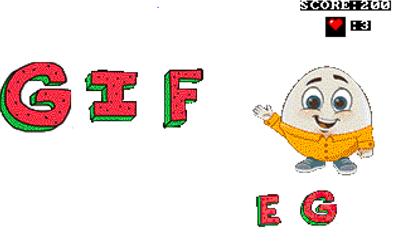
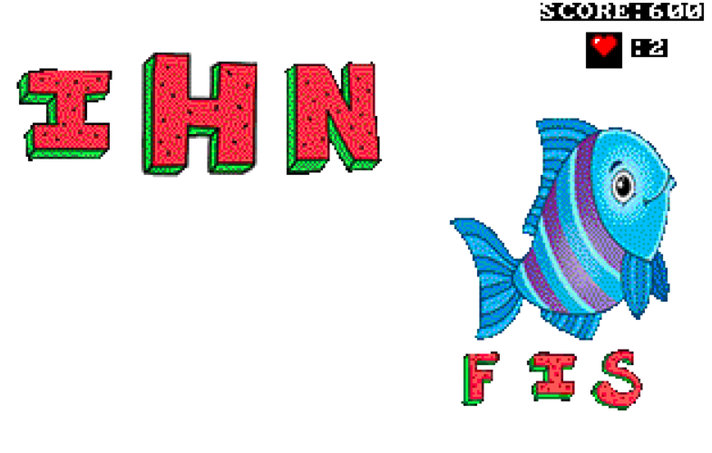

# Letters-Rain-Game

> A small game for children to learn alphabets by showing a photo and ask them to form its name by pressing the right key from the keyboard before letters reach the end of the screen.

> the game is counting score and it has limited number of hearts, if letters reach the bottom before choosing the right key you will lose a life and return to the beginning of the game and your score will be cleared, so you have only three tries to win the game before finishing your hearts.

